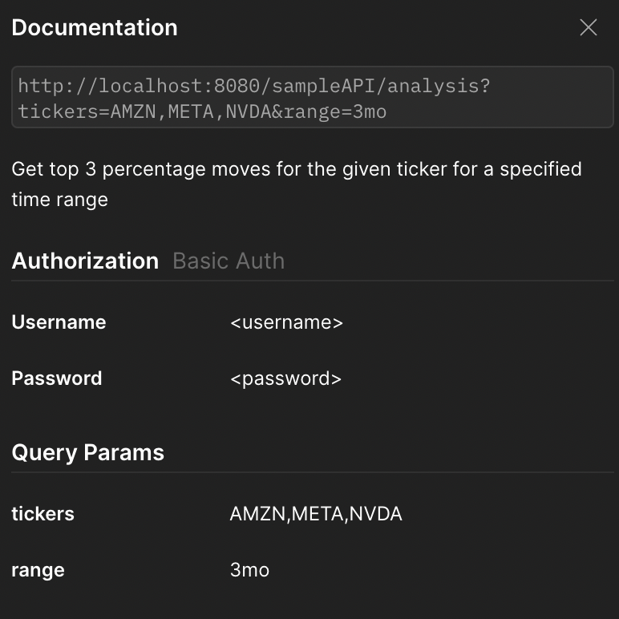

<h1 align="center">

[//]: # (  <br/>)
  Cantor Fitzgerald Assessment
</h1>

<div id="header" align="center">
  
</div>

### 🌐 Prerequisite Versions:

- Java: 1.8
- Spring boot: 2.1.1

### ⚡ Quick Setup

1. Clone the GitHub repo in your local
2. Build maven project ([Refer docs](https://metamug.com/article/java/build-run-java-maven-project-command-line.html))
    ```bash
    mvn clean install
    mvn compile
    ```
3. Run the Spring boot - Java project. The spring boot server is running on 8080 port. Use API endpoint to test whether
   the server is running or not
    - GET http://localhost:8080/sampleAPI/test

    - The project can be complied & executed in 2 ways:
        1. By importing project in Intellij/Eclipse and run using `run` button on the CanterDemoApplication file
        2. By compiling and running jar file:
           ```java -jar target/canter-demo-0.0.1-SNAPSHOT.jar ```

4. API End point:
    - http://localhost:8080/sampleAPI/analysis?tickers={tickers}&range={range}
        - tickers: comma separated stock tickers
        - range: time range
    - The percentage moves is taken by 1 day interval. If you want to change default parameters, then update application.properties file as per requirement. 
    - Example: GET http://localhost:8080/sampleAPI/analysis?tickers=AMZN,META,NVDA&range=3mo
      - username and password can be retrieved or set from `user.properties` file.

    - 

- Find the jar file under target folder

### 🏛️ Project Structure:

- Clients: client to request from another services
- Controllers: Rest APIs endpoints
- Models: data classes and model for types
- Repositories: Queries and database transaction layer
- Security: Spring authentication layer and configuration
- Utils: Common classes and function which can be used globally in the project

#### 🔆 Key points to be noticed:

- One way to find top 3 percentage moves could be sort the list by consecutive adjCloses difference in ASC order. Take
  last 3 as your answer. But, the sorting algorithm takes `O(n logn)` time. As we need to find only 3 top stock
  analysis, then we can store top 3 element in local variable and each time update either of these based on difference
  values. This would have linear `O(n)` complexity. In case, we need the result for top `k` elements then PriorityQueue
  would be the best solution to use.
- Error handling for corner cases such as ticker name does not exist, invalid time range input etc.
- Use `user.properties` file to get available user credential and modification in it.

#### 🔜 Future Improvements:

- Cache can be used to improve performance. Each result would be stored in cache for certain amount of time in order to
  reduce load
- Improvised IAM. A database can be used to store user credential instead of storing it in user.properties file
- A yahoo client can be extended for each available APIs

##### ✴️ Postman collection:

Link: https://api.postman.com/collections/3753695-ef8977bc-ed78-4b73-858a-55de893c60cd?access_key=PMAT-01GSVXDR0ACACDVPX45TMWAYE9

##### 📹 Video Link:

Link: https://www.youtube.com/channel/UCgu0ePzhOtskwe1N8ck9aXg

#### 📲 Connect with me

<p align="center">
&nbsp; <a href="https://twitter.com/vaishvikb24" target="_blank" rel="noopener noreferrer"></a>  
&nbsp; <a href="https://www.linkedin.com/in/vaishvik-brahmbhatt-176948166/" target="_blank" rel="noopener noreferrer"></a>
&nbsp; <a href="mailto:vbrahmb2@stevens.edu" target="_blank" rel="noopener noreferrer"></a>
</p>

⭐️ From [Vaishvik](https://github.com/vaishvik24)
